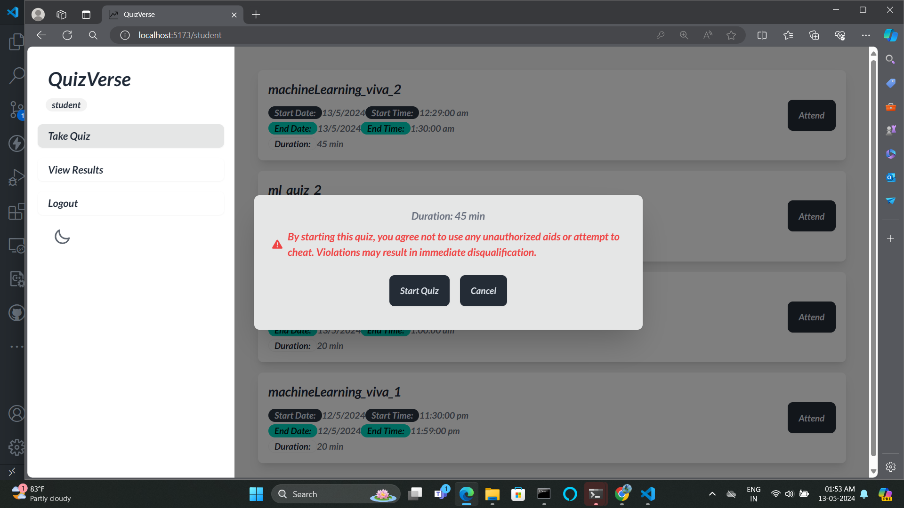

<!-- START doctoc generated TOC please keep comment here to allow auto update -->
<!-- DON'T EDIT THIS SECTION, INSTEAD RE-RUN doctoc TO UPDATE -->

- [QuizVerse 🎉](#quizverse-)
  - [Features](#features)
  - [Screenshots](#screenshots)
    - [General Pages](#general-pages)
      - [Home Page (User)](#home-page-user)
      - [Sign Up (Responsive)](#sign-up-responsive)
      - [Sign In (Responsive)](#sign-in-responsive)
      - [Page Not Found](#page-not-found)
      - [User Dashboard without role](#user-dashboard-without-role)
    - [Users](#users)
      - [Admin Dashboard](#admin-dashboard)
      - [Faculty Dashboard](#faculty-dashboard)
      - [Student Dashboard](#student-dashboard)
    - [Quizboard](#quizboard)
      - [Quiz Board](#quiz-board)
  - [Installation](#installation)
  - [Contributing](#contributing)
    - [Essential setup steps for maintaining code quality while contributing to the project](#essential-setup-steps-for-maintaining-code-quality-while-contributing-to-the-project)
    - [Adding auto prettier](#adding-auto-prettier)
    - [1. Install Prettier in Your Project](#1-install-prettier-in-your-project)
    - [2. Install Prettier Extension for VSCode](#2-install-prettier-extension-for-vscode)
    - [3. Create Prettier Configuration File](#3-create-prettier-configuration-file)
    - [4. Set Up VSCode Settings for Auto Formatting](#4-set-up-vscode-settings-for-auto-formatting)
    - [5. Add Prettier Ignore File (Optional)](#5-add-prettier-ignore-file-optional)
    - [6. Run Prettier Manually (Optional)](#6-run-prettier-manually-optional)

<!-- END doctoc generated TOC please keep comment here to allow auto update -->

# QuizVerse 🎉

QuizVerse is an interactive quiz platform designed to offer users a seamless experience for creating, participating in, and managing quizzes. The platform includes various user roles like admins, faculty, and students, each having specific functionalities. 🧑‍🏫🎓

## Features

-   🔐 User authentication and role-based access (Admin, Faculty, Student, Institution Admin)
-   📝 Creation and management of quizzes
-   📱 Responsive design for better accessibility
-   📊 Dashboard for managing quizzes and tracking progress

## Screenshots

### General Pages

#### Home Page (User)


#### Sign Up (Responsive)


#### Sign In (Responsive)


#### Page Not Found


#### User Dashboard without role


### Users

#### Admin Dashboard


#### Faculty Dashboard


#### Student Dashboard




### Quizboard

#### Quiz Board


## Installation

1. clone the project

```
    git clone https://github.com/jelanmathewjames/quizverse_frontend.git

```

2. move into the directory

```
    cd quizverse_frontend
```

3. Install dependencies

```
    npm i
```

4. Run the server

```
    npm run dev
```

## Contributing

### Essential setup steps for maintaining code quality while contributing to the project

1. Install the plugin

```
    npm i eslint-plugin-simple-import-sort
```

2. Add rule in `.eslintrc.cjs`

```
    'simple-import-sort/imports' : 'error',
```

3. Add simple-import-sort in the plugin array of '.eslintrc.cjs' file

```
    plugins: [...,'simple-import-sort']
```

4. Open settings.json in vscode configuration settings

5. add the following line

```
    "editor.codeActionsOnSave": {
        "source.fixAll.eslint": true
    }
```

### Adding auto prettier

To set up **Prettier** in your VSCode project and ensure that it automatically formats your code, follow these steps:

### 1. Install Prettier in Your Project

You need to install Prettier as a development dependency for your project.

-   Open a terminal in your project root and run the following command:

```bash
npm install --save-dev prettier
```

This will install Prettier locally for your project.

### 2. Install Prettier Extension for VSCode

1. Open **VSCode**.
2. Go to the **Extensions** tab by clicking on the square icon on the left sidebar or press `Ctrl+Shift+X`.
3. Search for "**Prettier - Code formatter**" by Esben Petersen.
4. Click **Install**.

### 3. Create Prettier Configuration File

In the root of your project, create a `.prettierrc` file to configure Prettier options. Here’s a basic example:

-   **.prettierrc** file:

```json
{
    "trailingComma": "es5",
    "tabWidth": 4,
    "semi": false,
    "singleQuote": true
}
```

You can customize the Prettier settings based on your preferences or team guidelines.

### 4. Set Up VSCode Settings for Auto Formatting

You need to tell VSCode to format your code using Prettier every time you save a file. Follow these steps:

1. Open the **Settings** by going to:

    - **File** > **Preferences** > **Settings** (or press `Ctrl + ,`).

2. In the search bar, type `editor.formatOnSave`.

3. Make sure the checkbox for **Editor: Format On Save** is checked.

4. Now you need to specify Prettier as your default formatter. In the settings search bar, type `default formatter`, and under **Editor: Default Formatter**, select **Prettier - Code Formatter**.

5. You can also add these settings in your project-level VSCode settings file (in the `.vscode/settings.json` file):
    ```json
    {
        "editor.formatOnSave": true,
        "editor.defaultFormatter": "esbenp.prettier-vscode"
    }
    ```

### 5. Add Prettier Ignore File (Optional)

If there are files or directories you don’t want Prettier to format, you can create a `.prettierignore` file in the root of your project.

-   Example **.prettierignore** file:
    ```plaintext
    node_modules/
    dist/
    .git/
    build/
    ```

### 6. Run Prettier Manually (Optional)

You can also format all files in your project manually by running this command:

```bash
npx prettier --write .
```

This will format all supported files in the project according to your Prettier configuration.

`Oh, you made it through all that? Impressive! 🎉 QuizVerse will be launching soon—get ready! 🚀😎
